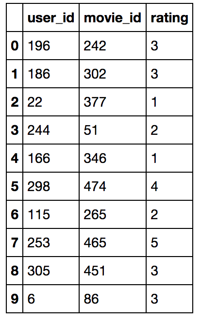
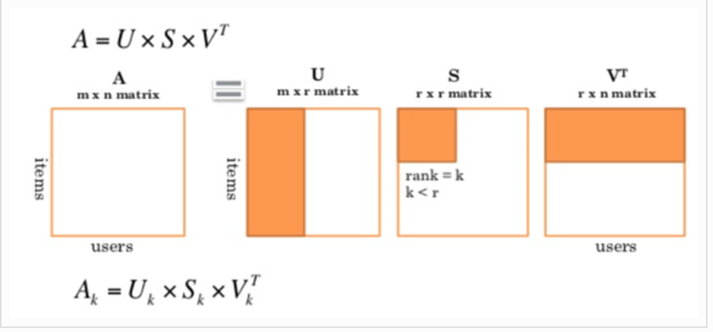

# SVD-Movie-Recommender

**Dataset**

This project involved using Singular Value Decomposition (SVD) – a dimensionality reduction method -  to generate movie recommendations. Given the ratings of some movies users have watched, I want to determine what other movies they should watch. The primary aim of the task was to understand SVD on an intuitive level and to then compute a Python algorithm on a sparse matrix.
The movie dataset was from Movielens and the method was inspired from Antoine Vastel. 
The dataset is a data frame consists of ten thousand ratings from 943 users on 1682 different movies. 
The most active user has rated 737 movies and the least active user has rated 20 movies. 

**Algorithm**

Initially, to prepare for SVD, a user by movie matrix was created. Since not everyone has rated/watched every movie, we have a sparse matrix, which requires special attention to matrix formats while doing decomposition. Subsequently, I created an empty dictionary called “user_Rec” that has userIDs as keys and empty lists as values, so I can later append movie recommendations to. I also created another dictionary called “movies_Seen” that contains all the movies each user has rated to avoid recommending those to them later. 

For SVD implementation, I resorted to a python package, sparseSVD, which is specifically designed for sparse matrices. In order to use sparseSVD, the movie ratings matrix is modified to be in Compressed Sparse Column (CSC) format by executing scipy sparse tool. SparseSVD returns matrix U transposed, matrix V transposed, and an array of singular values. Following the decomposition, U matrix is transposed to be in (m x k) dimension, and diagonal singular value matrix is created, called S matrix. To prepare for constructing the estimation, U, S, Vt were returned in Compressed Sparse Row (CSR) format. CSC and CSR is similar to each other. For CSC, computers will take each non-zero value column by column and returns column indices, the non-zero values and their row offsets. Whereas CSR, computers will take each non-zero value row by row and returns column indices, the non-zero values and their column offsets. In general, if matrices have more rows than columns, one should employ CSC, otherwise, use CSR. Sparse matrices demand CSC and SCR conversion for efficient and faster computations.

It is difficult to determine a pattern and relationship among data points within a large matrix. Therefore, SVD is a very useful method to reduce dimensions of matrices yet still retain important data. SVD also efficiently groups users and features together based on the number of concepts (K value) lying within the dataset; in this case, “movie genre”. Depending on K value one puts in SVD function, it generates different dimension reductions. The higher the K value is, the closer the approximation to the original matrix. However, if K is too large, then we would have a very similar matrix to the original one, hence fails to give estimations. On the other hand, small K value tends to generalize the features and users too much, which gives less accurate predictions. Therefore, one should be mindful when determine K value. 

**SVD Interpretation**

** For this project, I use K value of 50, which gives me a decent ratings approximation so that each user still gets recommendation, except for five users who have number of ratings higher than 400 movies. 
U matrix connects users to concepts. Its dimension is user by concept. U matrix presents weight of each concept on each user. For example, my first user has non-zero values for all 50 concepts, meaning that he has watched all movies in these 50 categories. Eigenvectors in U transposed indicate users’ preferences for each concept. For the first user, he has the highest score on the 47th concept, indicates that he likes this concept the most, in which he gives the highest ratings to. We then later multiply his preference on individual concepts to the movie matrix and the movies that belong to that specific concept will naturally have higher estimations.** 

**V matrix connects movies to concepts. Its dimension is movie by concept. Eigenvectors in this matrix indicate the weight of each concept in each movie. For example, with V transposed, I present the first 50 movies corresponding to 3 concepts. We see that the first movie has higher “relevant” score to the first and the second concept than to the third concept. The higher values the more relevant the movie is to that specific concept. Singular Values express the strength of each concept in the dataset, which is ordered in descending order in a diagonal matrix. Intuitively, the first concept is stronger because the data provides more information about the movies of that genre and the people who like them.**

**To find the strength of each concept of these movies according to this dataset, Vt matrix is multiplied to S, the singular value matrix. To find what movies each user likes, U matrix is multiplied to the product of Vt and S. Since the estimation matrix is in CSR format, I condensed it by using scipy function “todense” and then take the best 250 estimated ratings to choose from for each user. In order to not recommend already seen movies to the same user, a for loop was enforced that only appends the movieIDs which are not already in the “movies_Seen” dictionary created above. A condition that only recommends 5 new movies to each user was also added in the loop. By comparing to items table, I convert movieIDs to movie titles. As a result, we have a dictionary which has each user maps to a list of 5 movies. **

